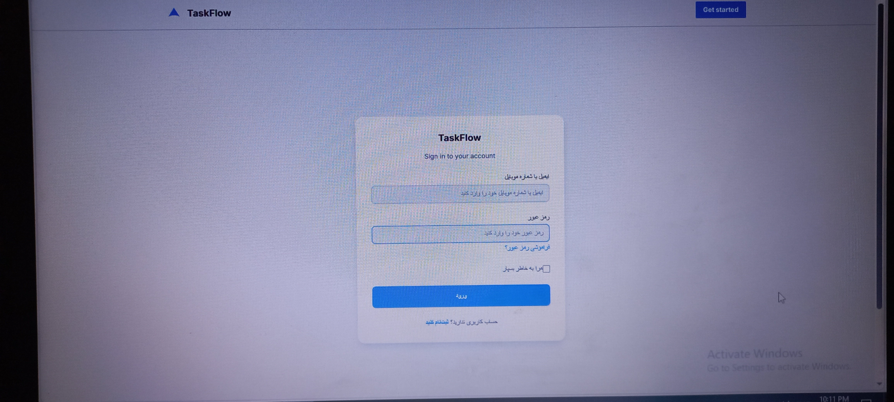
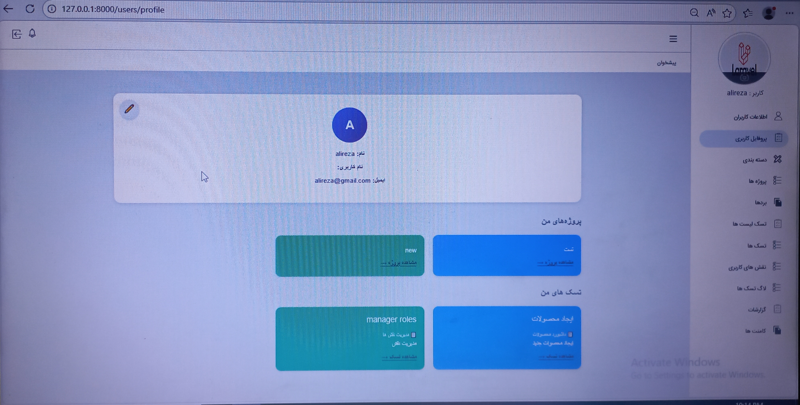

# Trello Clone

A modular Trello-like project management application built with Laravel.

## Overview

This project was developed as a personal learning and portfolio project to practice software architecture, 
modular design, and backend development concepts using Laravel.

The application allows users to manage boards, task lists, tasks, categories, roles, permissions, 
and media attachments.

## Features

* User Authentication (Laravel Sanctum)
* Custom Role & Permission System
* Project Boards
* Task Lists
* Task Management
* Drag & Drop Task Movement
* Categories
* Media Uploads
* Activity Logging (In Progress)
* Modular Architecture
* OTP-ready SMS Module
* Configurable SMS Providers

## Architecture

The project follows a modular architecture and includes:

* Contracts Layer
* Repository Layer
* Service Layer

The main goal of this architecture is to improve maintainability, reduce code duplication, 
and separate business logic from data access logic.

## Additional Components

### SMS Module

The project includes a configurable SMS module based on the Provider Pattern.

Currently supported providers:

- Kavenegar SMS Provider
- Log SMS Provider (for local development and testing)

New providers can be added by implementing the SmsProviderInterface contract.

## Modules

* User
* ProjectBoard
* Task
* TaskList
* RolePermission
* Media
* Category
* Log (Under Development)
* Sms

## Technologies

* PHP
* Laravel
* MySQL
* Blade
* Laravel Sanctum
* PHPUnit
* Git

## Database Design

The project uses:

* Migrations
* Seeders
* Factories
* One-to-Many Relationships
* Many-to-Many Relationships
* Pivot Tables

## Testing

Basic automated tests have been implemented for the User module using PHPUnit.

## Screenshots

### Login Page



### Dashboard



### Project Board


### Role & Permission


## Installation

```bash
git clone <repository-url>

cd project

composer install

cp .env.example .env

php artisan key:generate

php artisan migrate --seed

php artisan serve
```

## Project Status

This project is currently under active development.

Some modules such as Activity Log are still in progress.

## Purpose

The primary goal of this project is to improve practical knowledge of Laravel, software architecture, 
design patterns, testing, and backend development best practices.

---

## فارسی

این پروژه یک نمونه مشابه Trello است که با Laravel توسعه داده شده
و هدف اصلی آن تمرین معماری نرم‌افزار، توسعه ماژولار و پیاده‌سازی مفاهیم Backend به صورت عملی بوده است.

### ویژگی‌ها

* احراز هویت با Laravel Sanctum
* مدیریت نقش و سطح دسترسی (پیاده‌سازی اختصاصی)
* مدیریت Board ،TaskList و Task
* Drag & Drop برای جابه‌جایی Taskها
* مدیریت فایل‌ها از طریق Media Module
* معماری ماژولار
* Service Layer
* Repository Layer
* Contracts
* تست اولیه برای بخشی از سیستم

این پروژه همچنان در حال توسعه است و برخی بخش‌ها مانند Activity Log در حال تکمیل هستند.
